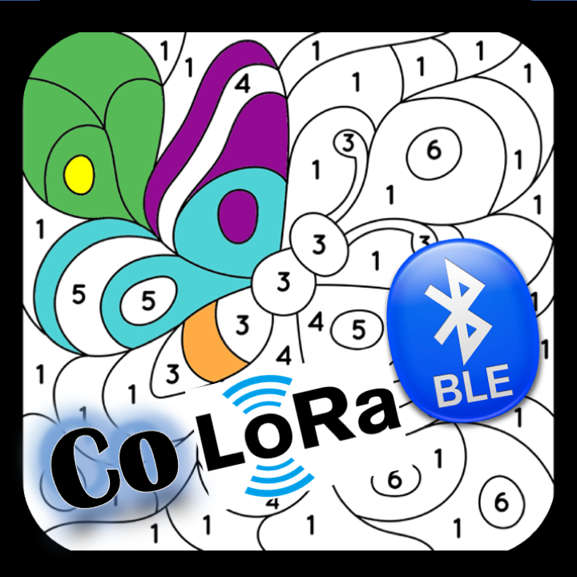

# CoLoRaBLE
Code for a [LoRa](https://en.wikipedia.org/wiki/LoRa) [BLE](https://en.wikipedia.org/wiki/Bluetooth_Low_Energy) device based on the [SparkFun LoRa Gateway - 1-Channel (ESP32)](https://www.sparkfun.com/products/18074)

## News
- The CoLoRaBLE iOS App is now published in the Apple App Store! Check it out: https://apps.apple.com/us/app/colorable-code-for-lora-ble/id1575668696 and see a video demo of the app in action here: https://www.youtube.com/watch?v=ltvkS5mSGhw

## What is it?
The CoLoRaBLE project is an open-source software and hardware initiative to help prototype devices that communicate with each other via "Long-Range" (LoRa) low power mesh radio network and connect to phones over Bluetooth Low Energy (BLE). 

## Applications 
- Off-grid text messaging when cellular service is not available. Communicate when hiking, share GPS coordinates & see friends on map
- Remote temperature controller, see temperature inside the car & turn on a fan remotely
- Remote camera, see pictures from remote device

## Hardware
This project is built on top of the [SparkFun LoRa Gateway - 1-Channel (ESP32)](https://www.sparkfun.com/products/18074) with the [Pycom LoRa and Sigfox Antenna Kit - 915MHz](https://www.sparkfun.com/products/14676). 

## Software
- Device side software targets the ESP32 using Arduino. 
- Phone side software currently only supports iOS. 
