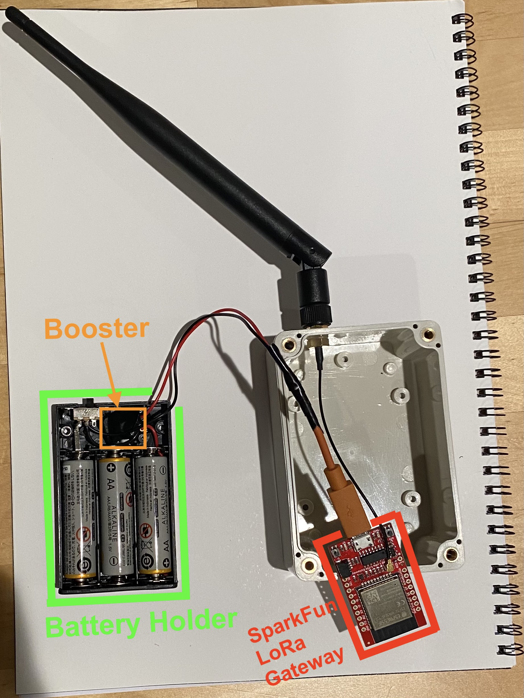

# CoLoRaBLE Hardware

This project is built on top of the [SparkFun LoRa Gateway - 1-Channel (ESP32)](https://www.sparkfun.com/products/18074) with the [Pycom LoRa and Sigfox Antenna Kit - 915MHz](https://www.sparkfun.com/products/14676). The device is battery powered using [3x AA Battery Holder with On/Off Switch and 2-Pin JST](https://www.adafruit.com/product/4779). Since the SparkFun board is powered by a Micro-USB connector, it expects to get 5-volts (instead of the ~4.5v from 3x AA batteries). The [Adafruit MiniBoost 5V @ 1A - TPS61023](https://www.adafruit.com/product/4654) boosts the battery voltage to 5-volts and conveniently fits inside some dead space inside the battery holder. It is wired between the battery and switch, and the wires coming out of the battery holder are from the booster board and connected to the power pins on a Micro-USB cable. To power the board this cable is just plugged into the Micro-USB port on the board and turned on using the slide-switch on the battery holder.

Ive enclosed everything using [LeMotech ABS Plastic Junction Box](https://www.amazon.com/gp/product/B07C97HXX8) and drilled a hole for the SMA antenna connector. Eventually ill more securely mount the board/battery inside.

